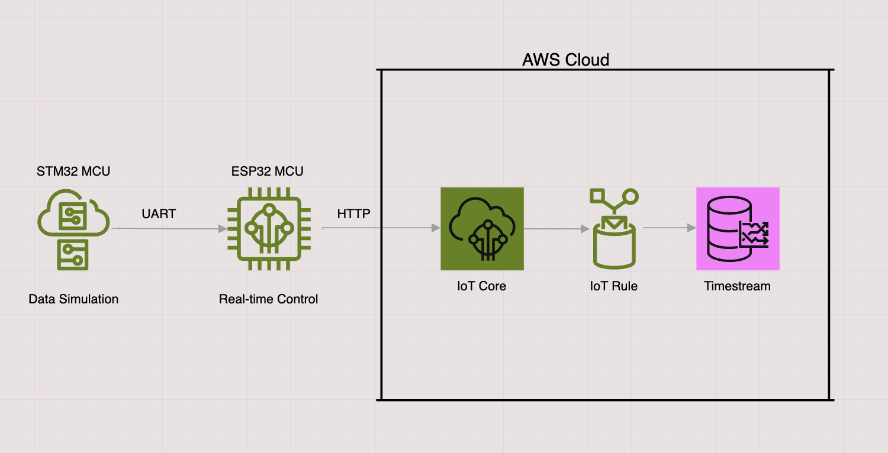
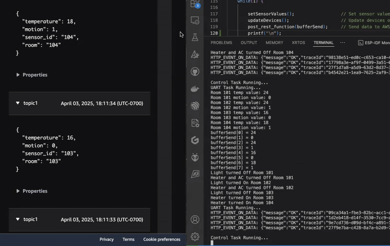

## IoT System with STM32 and ESP32

A scalable IoT solution combining STM32 for sensor simulation and ESP32 for cloud connectivity, built with FreeRTOS and AWS IoT Core.

## 🚀 Project Overview
A complete IoT demonstration platform featuring:
- **STM32** as sensor data generator (simulating digital sensors via HAL)
- **ESP32** as edge gateway with FreeRTOS real-time scheduling
- **AWS IoT Core** for secure cloud connectivity
- **Infrastructure-as-Code** provisioning with Terraform

---
### 🔑 Key Features:
🧪 **Sensor Simulation** [Link](https://github.com/HajjSalad/STM32-Sensor-Data-Simulation)   
&nbsp;&nbsp;&nbsp;• Simulated sensor readings using STM32 HAL, including ADC, PWM, and Timers.  
🔁 **Reliable Data Transfer**  
&nbsp;&nbsp;&nbsp;• Data transmission from STM32 to ESP32 via UART with a handshake mechanism.   
⏱️ **Real-Time Scheduling on ESP32**  
&nbsp;&nbsp;&nbsp;• Leveraging FreeRTOS for efficient real-time task scheduling and management.  
🧩 **Modular OOP Architecture**  
&nbsp;&nbsp;&nbsp;• Applied OOP principles to design a hierarchical class structure for sensor and device management.  
☁️ **Cloud Integration**    
&nbsp;&nbsp;&nbsp;• Data is transmitted to AWS IoT Core for real-time monitoring  
&nbsp;&nbsp;&nbsp;• AWS IoT Rules are used to store data in AWS Timestream for analytics.  

---
### 📡 **Interrupt-Driven Handshake UART**
Ensures reliable data transfer between STM32 (transmitter) and ESP32 (receiver):
```
|         STM32                 |         ESP32                    |
|    Send: "READY?"             |                                  |
|                               |   Received: "READY?"             |
|                               |   Response: "YES"                |
|   Received: "YES"             |                                  |
|   Send: <DATA_PACKET>         |                                  |
|                               |   Received: <DATA_PACKET>        |
|                               |   Responded with: "ACK"          |
|   Received: "ACK"             |                                  |
|   [Transmission Complete]     |   [Process Data]                 |
```

---
### 🧱 Modular, Scalable Sensor & Device Architecture
🏠 `Room` (Base Class)  
&nbsp;&nbsp;&nbsp;• Abstract representation of a room within the system.  
&nbsp;&nbsp;&nbsp;• Specialized subclasses: LivingRoom, BedRoom.  
🌡️ `Sensor` (Base Class)  
&nbsp;&nbsp;&nbsp;• Generic interface for all sensor types.  
&nbsp;&nbsp;&nbsp;• Specialized subclasses: TempSensor, MotionDetector.  
🔌 `Device` (Base Class)  
&nbsp;&nbsp;&nbsp;• Common interface for all controllable devices.  
&nbsp;&nbsp;&nbsp;• Specialized subclasses: Light, AC, Heater.

#### 🧩 **Room Configuration**  
🪟 A `Room` can either be a `BedRoom` or a `LivingRoom`  
🚪 Each `LivingRoom` or `BedRoom` contains:  
&nbsp;&nbsp;&nbsp;• 1 `TempSensor`, 1 `MotionDetector`  
&nbsp;&nbsp;&nbsp;• 1 `Light`, 1 `AC`, 1 `Heater`  

💡 **Room Creation and Sensor Usage Example**  
```c
// Create a LivingRoom instance with a specific room number
int roomNum = 101;
void* room1 = createLivingRoom(roomNum);

if (!room1) {            // Check if room creation successful
    printf("LivingRoom creation failed.\n");
    return;
} else {
    printf("LivingRoom %d created.\n\r", roomNum);
}

// Sensor values (example data)
float tempValue = 27.5;
int motionValue = 1;  // 1 = motion detected, 0 = no motion

// Set sensor values
setTempSensorValue(room1, tempValue);
setMotionDetectorValue(room1, motionValue);
```
⏲️ **Device Control Based on Sensor Data**
```c
if (getMotionDetectorValue(room1)) {         // Turn on light if motion is detected
    turnOnLight(room1);
    printf("Light turned ON in Room %d\n\r", roomNum);
}

float temp = getTempSensorValue(room1);      // Read current temperature

// Control AC and Heater based on temperature range
if (temp > 25.0) {                           // Temp too hot
    turnOnAC(room1);
    turnOffHeater(room1);
    printf("AC turned ON in Room %d\n\r", roomNum);

} else if (temp < 20.0) {                    // Temp too cold
    turnOffAC(room1);
    turnOnHeater(room1);
    printf("Heater turned ON in Room %d\n\r", roomNum);

} else {                // Temperature is in comfortable range (20–25°C)
    turnOffAC(room1);
    turnOffHeater(room1);
    printf("Heater and AC turned OFF in Room %d\n\r", roomNum);
}
```

---
### 🏗 System Architecture
```
[STM32 (Simulate data)] → [UART] → [ESP32 (FreeRTOS & Cloud Gateway)] → [MQTT] → [Cloud Dashboard]
```

### 🛠️ Development Tools & Software
𐂷 **Microcontroller Development**  
&nbsp;&nbsp;&nbsp;⎔ **STM32 Development**  
&nbsp;&nbsp;&nbsp;&nbsp;&nbsp;&nbsp;• STM32CubeIDE – Integrated development environment for STM32 firmware   
&nbsp;&nbsp;&nbsp;&nbsp;&nbsp;&nbsp;• ST-Link Debugger – Enables flashing and debugging over SWD      
&nbsp;&nbsp;&nbsp;⎔ **ESP32 Development**:  
&nbsp;&nbsp;&nbsp;&nbsp;&nbsp;&nbsp;• ESP-IDF - Official development framework for ESP32 firmware  
&nbsp;&nbsp;&nbsp;&nbsp;&nbsp;&nbsp;• VS Code - Development environment with ESP-IDF integration and UART debugging    
🌐 **Cloud Infrastructure**    
&nbsp;&nbsp;&nbsp;⎔ **AWS IoT Core** - Secure MQTT messaging and device connectivity     
&nbsp;&nbsp;&nbsp;⎔ **AWS Timestream** - Time-series database for storing and analyzing sensor data     
&nbsp;&nbsp;&nbsp;⎔ **Terraform** - Automates the provisioning and configuration of AWS infrastructure     
⚙️ **Hardware**  
&nbsp;&nbsp;&nbsp;⎔ **STM32 MCU** - Microcontroller used for real-time sensor data acquisition and local processing     
&nbsp;&nbsp;&nbsp;⎔ **ESP32 MCU** - Acts as the cloud gateway, handling connectivity and communication with AWS   

### Hardware Connection
```
|     **STM32 PIN**     |  **Interface**   |     **ESP32 Pin**         |  
|    PA9 - USART1_TX    |      UART        |     GPIO17 - UART2_TX     |  
|    PA10 - USART1_RX   |      UART        |     GPIO16 - UART2_RX     |  
|        GND            |      GND         |      GND                  |  
```
---
### 📂 Project Code Structure
```
📁 IoT-Control-Monitor-System/
├── 📁 stm32_sensor_node/                # STM32 Firmware (Sensor Data Simulation)
│   ├── 📁 Core/
│   │   ├── 📄 main.c                    # Application entry point
│   │   ├── 📄 stm32f4xx_it.c            # Interrupt handlers
│   │   ├── 📄 system_stm32f4xx.c        # System clock configuration
│   │   └── 📁 Inc/                      # Header files
│   ├── 📄 STM32F446RETX_FLASH.ld        # Flash memory linker script
│   └── 📄 STM32_UART_ESP32.ioc          # CubeMX configuration file
│
├── 📁 esp32_cloud_gateway/              # ESP32 Gateway Firmware
│   ├── 📁 main/
│   │   ├── 📄 main.c                    # FreeRTOS tasks
│   │   ├── 📄 uart.[c/h]                # UART driver (STM32 communication)
│   │   ├── 📄 wifi.[c/h]                # WiFi connection manager
│   │   └── 📄 cloud.[c/h]               # AWS IoT Core MQTT interface
│   │
│   ├── 📁 components/                   # OOP Device Management
│   │   ├── 📄 rooms.[cpp/h]             # Room base class
│   │   ├── 📄 sensors.[cpp/h]           # Sensor base class
│   │   ├── 📄 devices.[cpp/h]           # Device management
│   │   └── 📄 wrapper.[cpp/h]           # C-compatible interfaces
│   │
│   ├── 📁 iot-aws-terraform/            # Infrastructure as Code
│   |   ├── 📄 main.tf                   # AWS resource definitions
│   ├── └── 📄 outputs.tf                # Cloud deployment outputs
|   |
│   └── 📄 CMakeLists.txt                # Build system configuration
│
└── 📄 README.md                         # Project documentation
```

### Diagram


#### Demo
&nbsp;&nbsp;&nbsp;AWS IoT Core&#8195;&#8195;&#8195;&#8195;&#8195;&#8195;&#8195;&#8195;&#8195;&#8195;&#8195;&#8195;&#8195;&#8195;&#8195;&#8195;&#8195;&#8195;Serial Terminal

