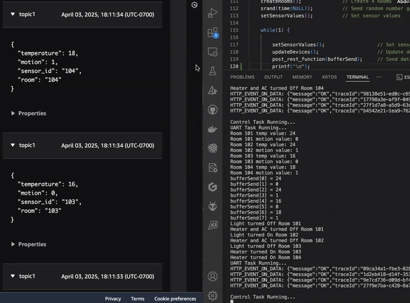

## IoT Monitor and Control with STM32 & ESP32

A scalable IoT solution combining STM32 for sensor simulation and ESP32 for cloud connectivity, built with FreeRTOS and AWS IoT Core.

## 🚀 Project Overview
A complete IoT demonstration platform featuring:
- **STM32** as sensor data generator (simulating digital sensors via HAL)
- **ESP32** as edge gateway with FreeRTOS real-time scheduling
- **AWS IoT Core** for secure cloud connectivity
- **Infrastructure-as-Code** provisioning with Terraform

---
### 🧪 STM32 Sensor Node 
The FreeRTOS-based Sensor Node is  structured around a C++ object model wrapped in a C interface. It monitors temperature and motion, drives climate and lighting control, and forwards sensor data and device state to an ESP32 over UART.

#### 🧱 Object Model
**Class Hierarchy & Composition**     
Sensors and devices are grouped into typed inheritance hierarchies, composed together inside a `Room`:
```
Sensor (abstract)           Device (abstract)           Room
├── MotionDetector          ├── Light                   ├── MotionDetector    (1)
└── TemperatureSensor       ├── AC                      ├── TemperatureSensor (1)
                            └── Heater                  ├── Light             (1)
                                                        ├── AC                (1)
                                                        └── Heater            (1)
```
`Room` is a concrete aggregate that owns one instance of every sensor and device type and exposes a unified control interface.    
New sensor or device types can be added by extending the base classes, and new room types by deriving from `Room` — without modifying existing code.


#### 🧵 Task Model
| Task | Priority | Responsibility |
|---|---|---|
| `SensorWrite` | 5 | Simulates sensor readings via `rand()`, writes to `Room` via C wrapper |
| `SensorRead` | 4 | Reads sensor values from `Room`, packages into `SensorData_t`, sends to `SensorQueue` |
| `Controller` | 3 | Receives `SensorData_t`, makes device control decisions, forwards to stream buffer |
| `Transmit` | 2 | Reads `TransmitData_t` from stream buffer, forwards to ESP32 via UART1 |
| `Logger` | 1 | Sole writer to UART2 — drains `LogQueue` and prints all log messages |

#### 🔗 FreeRTOS Resources
| Resource | Type | Purpose |
|---|---|---|
| `xSensorMutex` | Mutex | Guards shared `Room` object between `SensorWrite` and `SensorRead` |
| `xSensorQueue` | Queue | Passes `SensorData_t` from `SensorRead` → `Controller` |
| `xLogQueue` | Queue | Passes log strings from all tasks → `Logger` |
| `xStreamBuffer` | Stream Buffer | Passes `TransmitData_t` from `Controller` → `Transmit` |

#### 🔀 Data Flow
```
┌─────────────┐     ┌─────────────┐
│ SensorWrite │────▶│ Room Object │
└─────────────┘     └──────┬──────┘
                           │
                           ▼
                    ┌────────────┐     ┌────────────┐     ┌──────────┐
                    │ SensorRead │────▶│ Controller │────▶│ Transmit │
                    └────────────┘     └────────────┘     └──────────┘

All tasks ──▶ LogQueue ──▶ Logger ──▶ Terminal
``` 

---
### 📡 **Interrupt-Driven Handshake UART**
Reliable bidirectional communication between STM32 and ESP32 using a simple request-response protocol:
```
|         STM32                 |         ESP32                    |
|    Send: "READY?"   ->        |                                  |
|                               |       Received: "READY?"         |
|                               |   <-  Response: "YES"            |
|   Received: "YES"             |                                  |
|   Send: <DATA_PACKET>   ->    |                                  |
|                               |       Received: <DATA_PACKET>    |
|                               |   <-  Responded with: "ACK"      |
|   Received: "ACK"             |                                  |
|   [Transmission Complete]     |   [Process Data]                 |
```
Ensures data integrity and coordinated transfers between devices.

---
#### ☁️ ESP32 Cloud Gateway
The ESP32 acts as a cloud gateway - receiving sensor data from the STM32 over UART, managing Wi-Fi connectivity, and publishing to AWS IoT Core over MQTT.

#### 🧵 Task Model
| Task | Responsibility |
|---|---|
| `uart_rxtx_task` | Receives sensor data from STM32 over UART2, handles ACK/READY protocol |
| `wifi_manager_task` | Initializes Wi-Fi, connects to AP, monitors and reconnects on dropout |
| `cloud_mqtt_task` | Connects to AWS IoT Core, drains `sensor_queue`, publishes JSON payloads |

#### 🔗 FreeRTOS Resources
| Resource | Type | Purpose |
|---|---|---|
| `uart_2_queue` | Queue | UART driver event queue — triggers `uart_rxtx_task` on incoming data |
| `sensor_queue` | Queue | Passes `sensor_data_t` from `uart_rxtx_task` → `cloud_mqtt_task` |
| `wifi_event_group` | Event Group | Signals Wi-Fi connection status via `WIFI_CONNECTED_BIT` |
| `mqtt_event_group` | Event Group | Signals MQTT connection status via `MQTT_CONNECTED_BIT` |

#### 🔀 Data Flow
```
┌──────────┐     ┌───────────────┐     ┌──────────────┐     ┌───────────┐
│  STM32   │────▶│ uart_rxtx     │────▶│ cloud_mqtt   │────▶│ AWS IoT   │
│  (UART2) │     │ _task         │     │ _task        │     │ Core      │
└──────────┘     └───────────────┘     └──────────────┘     └───────────┘
```

#### 📡 Wi-Fi & MQTT Connection Lifecycle
```
wifi_init()  ──▶  wifi_start()  ──▶  WIFI_EVENT_STA_CONNECTED
                                               │
                                               ▼
                                      IP_EVENT_STA_GOT_IP
                                               │
                                               ▼
                                     WIFI_CONNECTED_BIT set
                                               │
                                               ▼
                                         mqtt_init()  ──▶  TLS Handshake  ──▶  AWS IoT Core
                                               │
                                               ▼
                                     MQTT_CONNECTED_BIT set
                                               │
                                               ▼
                                        publish loop
```

---

### 🛠️ Development Tools & Software
𐂷 **Microcontroller Development**  
&nbsp;&nbsp;&nbsp;⎔ **STM32 Development**  
&nbsp;&nbsp;&nbsp;&nbsp;&nbsp;&nbsp;• STM32CubeIDE – Integrated development environment for STM32 firmware   
&nbsp;&nbsp;&nbsp;&nbsp;&nbsp;&nbsp;• ST-Link Debugger – Enables flashing and debugging over SWD      
&nbsp;&nbsp;&nbsp;⎔ **ESP32 Development**:  
&nbsp;&nbsp;&nbsp;&nbsp;&nbsp;&nbsp;• ESP-IDF - Official development framework for ESP32 firmware  
&nbsp;&nbsp;&nbsp;&nbsp;&nbsp;&nbsp;• VS Code - Development environment with ESP-IDF integration and UART debugging    
🌐 **Cloud Infrastructure**    
&nbsp;&nbsp;&nbsp;⎔ **AWS IoT Core** - Secure MQTT messaging and device connectivity     
&nbsp;&nbsp;&nbsp;⎔ **AWS Timestream** - Time-series database for storing and analyzing sensor data     
&nbsp;&nbsp;&nbsp;⎔ **Terraform** - Automates the provisioning and configuration of AWS infrastructure     
⚙️ **Hardware**  
&nbsp;&nbsp;&nbsp;⎔ **STM32 MCU** - Microcontroller used for real-time sensor data acquisition and local processing     
&nbsp;&nbsp;&nbsp;⎔ **ESP32 MCU** - Acts as the cloud gateway, handling connectivity and communication with AWS   

#### ⚙️ Hardware Connection
```
|       STM32 PIN       |    Interface     |     ESP32 Pin             |  
|    PA9  - USART1_TX   |      UART        |     GPIO16 - UART2_RX     |  
|    PA10 - USART1_RX   |      UART        |     GPIO17 - UART2_TX     |  
|        GND            |      GND         |           GND             |  
```

---
#### 📂 STM32 Code Structure
```
├── 📁 STM32_Sensor_Node/                        # STM32 Sensor Node Firmware
│   ├── 📁 Src/                                  # Source files
│   │   ├── 📄 main.c                            # Main entry point, FreeRTOS scheduler
│   │   ├── 📄 syscalls.c                        # System call stubs for HAL/RTOS
│   │   ├── 📄 uart.c                            # UART driver implementation
│   │   ├── 📁 core/                             # Core device classes
│   │   │   ├── 📄 devices.cpp                   # Device management
│   │   │   ├── 📄 rooms.cpp                     # Room abstraction classes
│   │   │   ├── 📄 sensors.cpp                   # Sensor base classes
│   │   │   └── 📄 wrapper.cpp                   # C-compatible interfaces
│   │   └── 📁 tasks/                            # FreeRTOS tasks
│   │       ├── 📄 task_controller.c             # Main control task
│   │       ├── 📄 task_logger.c                 # Data logging task
│   │       ├── 📄 task_sensor_read.c            # Sensor read task
│   │       ├── 📄 task_sensor_write.c           # Sensor write task
│   │       └── 📄 task_transmit.c               # Data transmission task
│   │
│   ├── 📁 Inc/                                   # Header files
│   │   ├── 📁 CMSIS/                             # Cortex-M core headers
│   │   ├── 📁 core/                              # Core class headers
│   │   ├── 📁 tasks/                             # Task headers
│   │   ├── 📄 shared_resources.h                 # Shared variables and defines
│   │   └── 📄 uart.h                             # UART interface definitions
│   │
│   ├── 📁 FreeRTOS/                              # FreeRTOS kernel source and config
│   ├── 📁 Build/                                 # Build output folder
│   ├── 📁 Startup/                               # Startup code and vector table
│   ├── 📄 Makefile                               # Build rules
│   ├── 📄 STM32F446RETX_FLASH.ld                 # Flash linker script
│   └── 📄 STM32F446RETX_RAM.ld                   # RAM linker script         
│                      
```
#### 📂 STM32 Code Structure
```
├── 📁 ESP32_Cloud_Gateway/                 # ESP32 Gateway Firmware
│   ├── 📁 main/                            # Core FreeRTOS tasks and entry point
│   │   ├── 📄 main.c                       # Main program, FreeRTOS scheduler and tasks
│   │   ├── 📄 CMakeLists.txt               # Build configuration for main folder
│   │   └── 📁 include/                     # Public headers for main tasks
│   │       └── 📄 task_priorities.h        # Task priority definitions
│   │
│   ├── 📁 components/                      # Modular firmware components
│   │   ├── 📁 mqtt/                        # MQTT communication module
│   │   │   ├── 📄 CMakeLists.txt           # Build configuration for MQTT component
│   │   │   ├── 📄 cloud_mqtt_task.c        # FreeRTOS task for MQTT communication
│   │   │   ├── 📄 mqtt_driver.c            # Core MQTT driver implementation
│   │   │   ├── 📁 include/                 # MQTT public headers
│   │   │   │   └── 📄 mqtt.h               # MQTT interface definitions
│   │   │   └── 📁 certs/                   # Certificates for AWS IoT Core
│   │   │
│   │   ├── 📁 uart/                        # UART communication module
│   │   │   ├── 📄 CMakeLists.txt           # Build configuration for UART component
│   │   │   ├── 📄 uart2_driver.c           # UART driver for hardware communication
│   │   │   ├── 📄 uart_rxtx_task.c         # FreeRTOS task for UART RX/TX
│   │   │   └── 📁 include/                 # UART public headers
│   │   │       └── 📄 uart.h               # UART interface definitions
│   │   │
│   │   └── 📁 wifi/                        # WiFi connectivity module
│   │       ├── 📄 CMakeLists.txt           # Build configuration for WiFi component
│   │       ├── 📄 wifi_driver.c            # Core WiFi driver implementation
│   │       ├── 📄 wifi_manager_task.c      # FreeRTOS task for WiFi management
│   │       └── 📁 include/                 # WiFi public headers
│   │           └── 📄 wifi.h               # WiFi interface definitions
│   │
│   └── 📄 CMakeLists.txt                   # Top-level build system configuration
```

#### Demo
&nbsp;&nbsp;&nbsp;AWS IoT Core&#8195;&#8195;&#8195;&#8195;&#8195;&#8195;&#8195;&#8195;&#8195;&#8195;&#8195;&#8195;&#8195;&#8195;&#8195;&#8195;&#8195;&#8195;Serial Terminal

