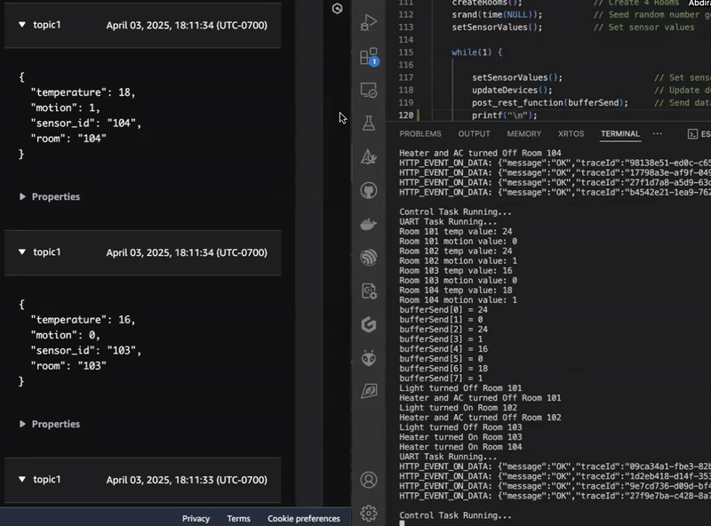

## 🌐 IoT Monitor and Control

A two-MCU embedded IoT system that monitors temperature and motion in a room,
drives climate and lighting control, and publishes telemetry to AWS IoT Core.
An STM32F446RE runs the sensor and control logic via FreeRTOS, forwarding data
over a custom binary UART protocol to an ESP32-WROOM-32E cloud gateway that
manages Wi-Fi connectivity, MQTT/TLS publishing, and OTA firmware updates via
AWS IoT Jobs and S3.

The system is split into three components:
- **🟠 STM32 Sensor Node** - FreeRTOS firmware, C++ object model, sensor sampling, control logic
- **🔵 UART Transport Protocol** - custom binary packet protocol with state machines, CRC and ACK/retry
- **🔴 ESP32 Cloud Gateway** - Wi-Fi, MQTT/TLS publishing, OTA firmware updates       

📓 Design notes, dev journal, and setup guides (STM32 & ESP32 project creation, design decisions) are documented in the [Project Notion Page](https://hajjsalad.notion.site/iot-monitor-control)   


---
### 🟠 STM32 Sensor Node 
FreeRTOS-based sensor and control firmware running on an STM32F446RE,
structured around a C++ object model wrapped in a C interface. Models the
room using a class hierarchy - sensors and actuators are represented as
objects, with an `extern "C"` wrapper layer bridging the C++ object model to
the C-based FreeRTOS task API. Monitors temperature and motion, drives
climate and lighting control, and forwards sensor data and device state to an
ESP32 gateway over a custom UART protocol.

#### 🔬 Sensor Stack
| Sensor | Measurement | Interface | Status |
|---|---|---|---|
| TMP102 | Temperature | I2C2 | Real hardware |
| PIR | Motion detected / not detected | GPIO Input + EXTI12 | Real hardware |

#### 🧱 Object Model
**Class Hierarchy & Composition**     
Sensors and devices are grouped into typed inheritance hierarchies, composed together inside a `Room`:
```
Sensor (abstract)           Device (abstract)           Room
├── MotionDetector          ├── Light                   ├── MotionDetector    (1)
└── TemperatureSensor       ├── AC                      ├── TemperatureSensor (1)
                            └── Heater                  ├── Light             (1)
                                                        ├── AC                (1)
                                                        └── Heater            (1)
```
`Room` is a concrete aggregate that owns one instance of every sensor and device type and exposes a unified control interface.    
New sensor or device types can be added by extending the base classes, and new room types by deriving from `Room` - without modifying existing code.   

#### 🧵 FreeRTOS Task Pipeline
| Task | Priority | Role |
|---|---|---|
| `vTaskSensorSample` | 8 | Samples TMP102 + PIR, writes to Room object |
| `vTaskSensorRead` | 7 | Reads from Room object, posts to `xSensorQueue` |
| `vTaskController` | 6 | Applies control logic, drives actuators |
| `vTaskRouter` | 5 | Drains UART stream buffer, frames packets, routes to TX/RX |
| `vTaskTX` | 4 | UART transmit state machine - handshake, data, ACK/retry |
| `vTaskRX` | 4 | Handles incoming commands from ESP32, sends ACKs |
| `vTaskLogger` | 3 | Drains log queue, outputs over UART2 |
| `vTaskWatchdogMonitor` | 9 | Checks task alive flags, kicks IWDG |

#### 🔗 FreeRTOS Resources
| Resource | Type | Purpose |
|---|---|---|
| `xSensorMutex` | Mutex | Guards shared `Room` object between `SensorSample` and `SensorRead` |
| `xSensorQueue` | Queue | Passes `SensorData_t` from `SensorRead` → `Controller` |
| `xTXQueue` | Queue | Passes `TXQueue_Item_t` from `Controller` → `TX` |
| `xRXQueue` | Queue | Passes incoming packets from `Router` → `RX` |
| `xLogQueue` | Queue | Passes log strings from all tasks → `Logger` |
| `xUartStreamBuffer` | Stream Buffer | Carries raw UART byte stream from ISR → `Router` |
| `xSampleTimer` | Software Timer | Triggers `SensorSample` every 5 seconds |
| `xSensorSampleHandle` | Task Handle | Notified by `xSampleTimer` callback |
| `xSensorReadHandle` | Task Handle | Notified by `SensorSample` after writing to `Room` |
| `xTXTaskHandle` | Task Handle | Notified by `Router` on incoming ACK packets |

#### 📡 Peripheral Drivers 
**`UART1` - ESP32 Communication**   
Bare-metal UART1 driver at 115200 baud. ISR receives bytes one at a time and
posts them into `xUartStreamBuffer` via `xStreamBufferSendFromISR`. Trigger
level of 8 bytes wakes `vTaskRouter`, which drains the buffer in chunks of 32
and frames packets using SOF (`0xAA`) / EOF (`0x55`) boundary detection.
```
PA9  — TX (AF7)
PA10 — RX (AF7)
```
**`UART2` - Debug Logging**   
Dedicated UART for terminal debug output. `vTaskLogger` is the sole writer - drains `xLogQueue` and transmits log messages without blocking other tasks.
```
PA2 - TX (AF7)
PA3 - RX (AF7)
```
**`I2C2` - TMP102 Temperature Sensor**   
Bare-metal I2C2 master driver at 100kHz standard mode. `vTaskSensorSample`
issues a read transaction each sample cycle and writes the result into the
`Room` object's `TemperatureSensor` via the C++ wrapper layer.
```
PB10 - SCL
PB11 - SDA
Address: 0x48
```
**`GPIO Input` - PIR Motion Sensor**      
PB12 configured as digital input with internal pull-up resistor. EXTI12
interrupt on falling edge. Falling edge sets a `volatile` motion flag inside
the ISR; `vTaskSensorSample` reads and clears it each cycle alongside the
temperature sensor - no polling required.
```
PB12 - EXTI12
pull-up, falling edge
```
**`IWDG` - Independent Watchdog**       
Hardware watchdog clocked by internal LSI oscillator (32kHz) - independent of system clock, cannot be disabled once started. `vTaskWatchdogMonitor` (Pri 7, highest) verifies all four tasks set their alive flags each cycle before kicking. If any task hangs and fails to set its flag - kick is withheld and MCU resets after timeout.
```
Prescaler  = /256  (PR = 6)
Reload     = 1250  (RLR)
Timeout    = (256 × 1250) / 32000 = 10 seconds
```
**`RTC` - Sampling Clock**   
Independent BCD timer/counter clocked by the internal LSI oscillator (32kHz).
Provides accurate timestamps for each sensor sample. Currently used for
timestamping.   

---
### 🔵 **UART Transport Protocol**
Custom full-duplex bidirectional binary protocol designed for reliable
communication between the STM32 sensor node and the ESP32 gateway over a
single UART link. Evolved through five design stages, currently implementing
Stage 3 with Stage 5 as the long-term target.
```
Stage 1 - raw byte stream
Stage 2 - structured packets, no validation
Stage 3 - CRC16 validation, ACK/retry         
Stage 4 - sequence numbering, flow control    <- current
Stage 5 - full-duplex, QoS levels, HAL layer  <- target
```
#### 📦 Packet Structure
```
| SOF(0xAA) | VER | DEV_ID | SEQ | TYPE | LEN | PAYLOAD | CRC16_H | CRC16_L | EOF(0x55) |
```
| Field | Size | Description |
|---|---|---|
| `SOF` | 1 byte | Start of frame - fixed `0xAA` |
| `VER` | 1 byte | Protocol version |
| `DEV_ID` | 1 byte | Sender device ID (STM32 / ESP32) |
| `SEQ` | 1 byte | Sequence number, 7-bit (`0x00`-`0x7F`) |
| `TYPE` | 1 byte | Packet type - see table below |
| `LEN` | 1 byte | Payload length (data packets only) |
| `PAYLOAD` | variable | Packet-specific data |
| `CRC16_H/L` | 2 bytes | CRC16 over header + payload |
| `EOF` | 1 byte | End of frame - fixed `0x55` |
#### 🗳️ Packet Types
| Direction | Type | Purpose |
|---|---|---|
| Either | `PKT_HANDSHAKE_REQ` | Initiates a transaction |
| Either | `PKT_HANDSHAKE_ACK` | Acknowledges handshake |
| STM32 → ESP32 | `PKT_TEMP_DATA` | Temperature reading |
| STM32 → ESP32 | `PKT_MOTION_DATA` | Motion detection state |
| STM32 → ESP32 | `PKT_MESSAGE_DATA` | General message payload |
| ESP32 → STM32 | `PKT_COMMAND` | Setpoint / threshold update |
| ESP32 → STM32 | `PKT_FIRMWARE` | OTA firmware chunk |
| Either | `PKT_*_ACK` | Acknowledges matching data packet |
#### 📜 Transaction
Each transaction tracks `seq`, `payloadType`, `retries`, `start_tick`/`end_tick`,
and `result` (`PENDING`/`SUCCESS`/`FAILED`) in a `TX_Transaction_t` struct.
Sequence number increments on both success and failure, guaranteeing
monotonically increasing sequence numbers regardless of outcome.   

Sequence numbers are split into two ranges so STM32 and ESP32 can each
generate sequence numbers independently without collision:
```
SEQ_STM32_BASE  0x00   // STM32-originated: 0x00, 0x01, 0x02 ... 0x7F
SEQ_ESP32_BASE  0x80   // ESP32-originated: 0x80, 0x81, 0x82 ... 0xFF
```
The high bit of `SEQ` doubles as an origin marker - `0x00`–`0x7F` identifies
a STM32-initiated transaction, `0x80`–`0xFF` identifies an ESP32-initiated
transaction, allowing either side to immediately tell who started a given
exchange just by inspecting the sequence byte.   

   

---
### ☁️ ESP32 Cloud Gateway
The ESP32 acts as a cloud gateway - receiving sensor data from the STM32 over UART, managing Wi-Fi connectivity, and publishing to AWS IoT Core over MQTT.

#### 🧵 Task Model
| Task | Responsibility |
|---|---|
| `uart_rxtx_task` | Receives sensor data from STM32 over UART2, handles ACK/READY protocol |
| `wifi_manager_task` | Initializes Wi-Fi, connects to AP, monitors and reconnects on dropout |
| `cloud_mqtt_task` | Connects to AWS IoT Core, drains `sensor_queue`, publishes JSON payloads |

#### 🔗 FreeRTOS Resources
| Resource | Type | Purpose |
|---|---|---|
| `uart2_queue` | Queue | UART driver event queue: triggers `uart_rxtx_task` on incoming data |
| `sensor_queue` | Queue | Passes `sensor_data_t` from `uart_rxtx_task` → `cloud_mqtt_task` |
| `wifi_event_group` | Event Group | Signals Wi-Fi connection status `WIFI_CONNECTED_BIT` |
| `mqtt_event_group` | Event Group | Signals MQTT connection status `MQTT_CONNECTED_BIT` |

#### 🔀 Data Flow
```
┌──────────────┐     ┌───────────────┐     ┌─────────────────┐     ┌──────────────┐
│ STM32 (UART2)│────▶│ uart_rxtx_task│────▶│ cloud_mqtt_task │────▶│ AWS IoT Core │
└──────────────┘     └───────────────┘     └─────────────────┘     └──────────────┘
```

#### 📡 Wi-Fi & MQTT Connection Lifecycle
```
wifi_init()  ──▶  wifi_start()  ──▶  WIFI_EVENT_STA_CONNECTED
                                               │
                                               ▼
                                      IP_EVENT_STA_GOT_IP
                                               │
                                               ▼
                                     WIFI_CONNECTED_BIT set
                                               │
                                               ▼
                                         mqtt_init()  ──▶  TLS Handshake  ──▶  AWS IoT Core
                                               │
                                               ▼
                                     MQTT_CONNECTED_BIT set
                                               │
                                               ▼
                                        publish loop
```

---
#### ⚙️ Hardware Connection & Sensor Wiring

| STM32 Pin | Interface | ESP32 Pin |
|---|---|---|
| PA9 - USART1_TX | UART | GPIO16 - UART2_RX |
| PA10 - USART1_RX | UART | GPIO17 - UART2_TX |
| GND | GND | GND |
```
| STM32 Pin | Interface | TMP102 Pin |
|---|---|---|
| PB10 — I2C2_SCL | I2C | SCL |
| PB11 — I2C2_SDA | I2C | SDA |
| 3.3V | Power | VCC |
| GND | GND | GND |

| STM32 Pin | Interface | PIR Sensor Pin |
|---|---|---|
| PB12 — EXTI12 | GPIO Input | OUT |
| 3.3V | Power | VCC |
| GND | GND | GND |

#### 📂 STM32 Code Structure
```
├── 📁 STM32_Sensor_Node/                        # STM32 Sensor Node Firmware
│   ├── 📁 Src/                                  # Source files
│   │   ├── 📄 main.c                            # Main entry point, FreeRTOS scheduler
│   │   ├── 📄 syscalls.c                        # System call stubs for HAL/RTOS
│   │   ├── 📄 uart.c                            # UART driver implementation
│   │   ├── 📁 core/                             # Core device classes
│   │   │   ├── 📄 devices.cpp                   # Device management
│   │   │   ├── 📄 rooms.cpp                     # Room abstraction classes
│   │   │   ├── 📄 sensors.cpp                   # Sensor base classes
│   │   │   └── 📄 wrapper.cpp                   # C-compatible interfaces
│   │   └── 📁 tasks/                            # FreeRTOS tasks
│   │       ├── 📄 task_controller.c             # Main control task
│   │       ├── 📄 task_logger.c                 # Data logging task
│   │       ├── 📄 task_sensor_read.c            # Sensor read task
│   │       ├── 📄 task_sensor_write.c           # Sensor write task
│   │       └── 📄 task_transmit.c               # Data transmission task
│   │
│   ├── 📁 Inc/                                   # Header files
│   │   ├── 📁 CMSIS/                             # Cortex-M core headers
│   │   ├── 📁 core/                              # Core class headers
│   │   ├── 📁 tasks/                             # Task headers
│   │   ├── 📄 shared_resources.h                 # Shared variables and defines
│   │   └── 📄 uart.h                             # UART interface definitions
│   │
│   ├── 📁 FreeRTOS/                              # FreeRTOS kernel source and config
│   ├── 📁 Build/                                 # Build output folder
│   ├── 📁 Startup/                               # Startup code and vector table
│   ├── 📄 Makefile                               # Build rules
│   ├── 📄 STM32F446RETX_FLASH.ld                 # Flash linker script
│   └── 📄 STM32F446RETX_RAM.ld                   # RAM linker script         
│                      
```
#### 📂 STM32 Code Structure
```
├── 📁 ESP32_Cloud_Gateway/                 # ESP32 Gateway Firmware
│   ├── 📁 main/                            # Core FreeRTOS tasks and entry point
│   │   ├── 📄 main.c                       # Main program, FreeRTOS scheduler and tasks
│   │   ├── 📄 CMakeLists.txt               # Build configuration for main folder
│   │   └── 📁 include/                     # Public headers for main tasks
│   │       └── 📄 task_priorities.h        # Task priority definitions
│   │
│   ├── 📁 components/                      # Modular firmware components
│   │   ├── 📁 mqtt/                        # MQTT communication module
│   │   │   ├── 📄 CMakeLists.txt           # Build configuration for MQTT component
│   │   │   ├── 📄 cloud_mqtt_task.c        # FreeRTOS task for MQTT communication
│   │   │   ├── 📄 mqtt_driver.c            # Core MQTT driver implementation
│   │   │   ├── 📁 include/                 # MQTT public headers
│   │   │   │   └── 📄 mqtt.h               # MQTT interface definitions
│   │   │   └── 📁 certs/                   # Certificates for AWS IoT Core
│   │   │
│   │   ├── 📁 uart/                        # UART communication module
│   │   │   ├── 📄 CMakeLists.txt           # Build configuration for UART component
│   │   │   ├── 📄 uart2_driver.c           # UART driver for hardware communication
│   │   │   ├── 📄 uart_rxtx_task.c         # FreeRTOS task for UART RX/TX
│   │   │   └── 📁 include/                 # UART public headers
│   │   │       └── 📄 uart.h               # UART interface definitions
│   │   │
│   │   └── 📁 wifi/                        # WiFi connectivity module
│   │       ├── 📄 CMakeLists.txt           # Build configuration for WiFi component
│   │       ├── 📄 wifi_driver.c            # Core WiFi driver implementation
│   │       ├── 📄 wifi_manager_task.c      # FreeRTOS task for WiFi management
│   │       └── 📁 include/                 # WiFi public headers
│   │           └── 📄 wifi.h               # WiFi interface definitions
│   │
│   └── 📄 CMakeLists.txt                   # Top-level build system configuration
```

#### Demo
&nbsp;&nbsp;&nbsp;AWS IoT Core&#8195;&#8195;&#8195;&#8195;&#8195;&#8195;&#8195;&#8195;&#8195;&#8195;&#8195;&#8195;&#8195;&#8195;&#8195;&#8195;&#8195;&#8195;Serial Terminal

